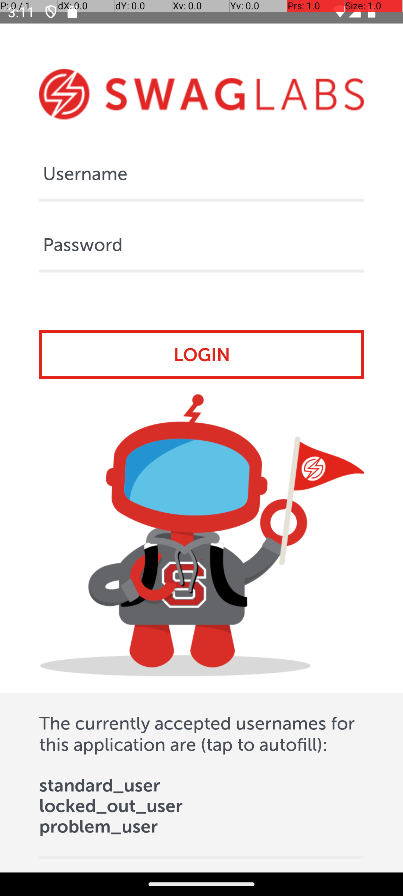

# AppiumTestNG

Framework de automatización de pruebas móviles **Android** para la app de demo **Swag Labs** (Sauce Labs), construido con **Java 17, Appium, TestNG, Maven y Allure**.


## Resumen ejecutivo

Proyecto de portafolio que automatiza 15 casos de prueba (18 ejecuciones con DataProviders) sobre login, catálogo, detalle de producto, carrito, formulario de checkout, menú lateral y deeplinks. Está pensado para mostrar un framework mantenible: Page Object, datos externos, gestos táctiles W3C, esperas explícitas, evidencia automática en fallos y reportes con Allure.

| | |
|---|---|
| **Plataforma** | Android (UiAutomator2), emulador o dispositivo físico |
| **App bajo prueba** | Swag Labs (`com.swaglabsmobileapp`), APK incluido |
| **Tests** | 15 métodos, 18 ejecuciones, grupos `regression` y `smoke` |
| **Última ejecución completa verificada** | **18 de 18 pasados**, 0 fallidos, 0 omitidos, sin reintentos activados (suite `regression`, ~8 min, emulador Android, Appium 3.7.0) |
| **CI** | Solo compila (`mvn test-compile`); los tests requieren emulador, ver [Integración continua](#integración-continua) |

> **Alcance honesto:** los resultados provienen de una sola máquina y un solo emulador, sin repeticiones suficientes para medir intermitencia. Ver [Limitaciones conocidas](#limitaciones-conocidas).

## Capturas

| Pantalla de login de la app bajo prueba (captura real del emulador) |
|:---:|
|  |

> La franja superior con valores «P: / dX: / dY:» es la opción de desarrollador *Pointer location* del emulador, no parte de la app.

<!-- MARCADORES: añade aquí capturas reales con el formato 
     - docs/images/allure-report.png  -> resumen del reporte de Allure (pendiente)
     - docs/images/ejecucion.gif      -> GIF de una ejecución en el emulador (pendiente) -->

## Qué demuestra este proyecto

| Habilidad | Dónde verlo |
|---|---|
| **Page Object Model** | [`pages/`](src/test/java/pages) (7 pantallas) sobre [`BasePage`](src/test/java/utilities/BasePage.java): locators privados, esperas y verificaciones encapsuladas; los tests no tocan locators. |
| **Flujos reutilizables** | [`CommonFlows`](src/test/java/utilities/CommonFlows.java): navegación hasta cada pantalla sin repetir el login en los tests. |
| **DataProviders con JSON, Excel y Faker** | [`CustomDataProviders`](src/test/java/data/CustomDataProviders.java): credenciales desde `credenciales.json` (Jackson), mensajes esperados desde `dataExcel.xlsx` (Poiji) y datos aleatorios con Datafaker ([`User`](src/test/java/models/User.java)). |
| **Gestos táctiles W3C** | [`Gestures`](src/test/java/utilities/Gestures.java): tap, long tap, doble tap, drag & drop y swipe con `PointerInput` y `Sequence`. |
| **Deeplinks** | [`Deeplinks`](src/test/java/utilities/Deeplinks.java) y [`DeeplinkTests`](src/test/java/saucedemo/DeeplinkTests.java): navegación directa a pantallas con `swaglabs://`. |
| **Allure** | `@Step` en cada acción de página, screenshot y page source adjuntos automáticamente en fallos ([`AllureListeners`](src/test/java/listeners/AllureListeners.java)). |
| **Aislamiento entre tests** | Driver en `ThreadLocal`, un driver por test, `SoftAssert` por hilo reiniciado en cada test. |
| **Fiabilidad acotada** | Reintento limitado a fallos de infraestructura ([`InfraRetryAnalyzer`](src/test/java/listeners/InfraRetryAnalyzer.java)); nunca reintenta aserciones ni locators. |
| **Configuración** | Timeouts centralizados y sobrescribibles con `-D` ([`Timeouts`](src/test/java/utilities/Timeouts.java)). |
| **Ejecución local** | `DriverManager` crea un `AndroidDriver` contra Appium en `127.0.0.1:4723`. |
| **Ejecución remota** | **No implementada.** Existe el punto de extensión (`JOB_NAME` → `buildRemoteDriver()`), pero el método está vacío. |

## Arquitectura

```
Test (saucedemo/)  ──►  CommonFlows  ──►  Page Objects (pages/)  ──►  BasePage
      │                                          │                        │
      │ extiende                                 │ usa                    │ usa
      ▼                                          ▼                        ▼
  BaseTest ──► DriverManager ──► DriverProvider (ThreadLocal<AndroidDriver>)
      │                                          ▲
      └─► Listeners (TestNG + Allure) ───────────┘  evidencia en fallos
Datos: data/ (JsonReader, ExcelReader, Parser, DataGiver, CustomDataProviders) ──► models/
```

| Paquete | Rol |
|---|---|
| `pages` | Un Page Object por pantalla: `LoginPage`, `ShoppingPage`, `ItemDetailPage`, `YourCartPage`, `YourInformationPage`, `TopBar`, `BurgerMenu`. |
| `saucedemo` | Clases de test; todas extienden `BaseTest`. |
| `utilities` | `BaseTest`, `BasePage`, `CommonFlows`, `DriverManager`/`DriverProvider`, `Gestures`, `Groups`, `Timeouts`, `Deeplinks`, `FileManager`, `Logs`. |
| `data` | `DataGiver` (credenciales), `JsonReader`, `ExcelReader`, `Parser` y `CustomDataProviders`. |
| `models` | `Credential`, `CredentialJson`, `ErrorMessage` (Poiji), `User` (Datafaker). |
| `listeners` | `TestListeners`, `SuiteListeners`, `AllureListeners`, `InfraRetryAnalyzer` y `RetryTransformer`. |
| `exceptions` | `FrameworkException`: error no recuperable con contexto (ruta, nombre, URL). |

### Estructura de carpetas

```
AppiumTestNG/
├── pom.xml                      # Dependencias y plugins
├── LICENSE                      # MIT
├── mvnw / mvnw.cmd              # Maven Wrapper
├── runSuite.sh                  # Ejecuta el grupo regression
├── openAllure.sh                # Genera y abre el reporte de Allure
├── .github/workflows/ci.yml     # CI: compila con mvn test-compile
├── .gitattributes               # Finales de línea y binarios
├── docs/images/                 # Capturas del README
└── src/
    ├── main/                    # Vacío (todo el código vive en src/test)
    └── test/
        ├── java/
        │   ├── data/  exceptions/  listeners/  models/
        │   ├── pages/  saucedemo/  utilities/
        └── resources/
            ├── apk/sauceLabs.apk
            ├── data/            # credenciales.json y dataExcel.xlsx
            ├── META-INF/services/  # Registro de listeners (Allure y reintentos)
            └── allure.properties
```

## Decisiones técnicas

| Decisión | Por qué |
|---|---|
| **Driver en `ThreadLocal` y uno por test** | Cada test arranca limpio y el diseño no impide ejecutar en paralelo. A cambio, cada test paga el arranque de la sesión (la suite tarda unos 8 minutos). |
| **`SoftAssert` por hilo, reiniciado en cada test** | Se comprobó que un `assertAll()` fallido conserva sus errores; con un `SoftAssert` por página, un fallo contaminaba los tests siguientes de la misma clase. |
| **Esperas explícitas, sin `sleep`** | Esperar una condición real es más rápido y más estable que un tiempo fijo. Los tiempos están en `Timeouts`, no dispersos. |
| **`UiScrollable.scrollIntoView` para llegar al botón Checkout** | Un swipe manual por coordenadas no desplazaba el carrito y el `setUp` fallaba siempre. El scroll nativo no depende de coordenadas ni de pausas. |
| **Reintento solo ante fallos de infraestructura** | Reintentar aserciones o locators ocultaría defectos. Solo se reintenta cuando se pierde la sesión o el servidor Appium es inalcanzable. |
| **`disableWindowAnimation=true`** | Reduce la variabilidad de esperas y gestos en el emulador. |
| **Datos externos (JSON y Excel)** | Separan los datos del código; el Excel conserva los mensajes esperados editables sin recompilar. |
| **`FrameworkException` con contexto** | Un error de configuración o de datos indica qué archivo, clave o URL falló, en lugar de una `RuntimeException` genérica o un `NullPointerException`. |
| **Constantes de grupos y timeouts** | `Groups` y `Timeouts` evitan strings y números mágicos repetidos. |
| **Dependencias en scope `test`** | `src/main` está vacío; todo el código es de pruebas. |

## Tecnologías y versiones

| Tecnología | Versión | Uso |
|---|---|---|
| Java | 17 | Lenguaje |
| Maven (wrapper `mvnw`) | 3.9.11 | Build y ejecución |
| Appium Java Client | 10.1.1 | `AndroidDriver`, `AppiumBy` |
| Selenium | 4.50.0 (transitiva de `java-client`) | `WebDriverWait`, `PointerInput`/`Sequence` |
| TestNG | 7.10.2 | Tests, grupos y DataProviders |
| Allure TestNG | 2.34.0 | Reportes, `@Step` y `@Attachment` |
| allure-maven | 2.15.2 | `allure:serve` / `allure:report` |
| AspectJ Weaver | 1.9.24 | Agente requerido por `@Step`/`@Attachment` |
| Maven Surefire | 3.2.5 | Ejecución (`testFailureIgnore=true`) |
| Log4j2 (core + api) | 2.26.1 | Logging (logger `AUTOMATION`) |
| log4j-slf4j-impl | 2.26.1 | Binding SLF4J 1.x → Log4j2 |
| Poiji | 5.4.0 | Excel a objetos Java |
| Jackson Databind | 2.22.2 | JSON |
| Datafaker | 2.7.0 | Datos aleatorios |
| jsoup | 1.23.2 | Formato del page source |
| commons-io | 2.21.0 | Utilidades de archivos |

## Requisitos previos

1. **JDK 17** (`java -version`).
2. **Maven** (opcional: se incluye `mvnw`).
3. **Node.js** y **Appium 2 o 3** con el driver UiAutomator2:
   ```bash
   npm install -g appium
   appium driver install uiautomator2
   ```
4. **Android SDK** con `adb` y un **emulador (AVD)** o dispositivo físico, con `ANDROID_HOME` configurada y `platform-tools` en el `PATH`.
5. **APK** en `src/test/resources/apk/sauceLabs.apk` (incluido). Ver [Sobre el APK](#sobre-el-apk).
6. **Servidor Appium en ejecución** en `http://127.0.0.1:4723/` antes de lanzar los tests (el proyecto no lo inicia):
   ```bash
   appium
   ```

### Sobre el APK

`sauceLabs.apk` (25 MB) es la app de demo **Swag Labs** (paquete `com.swaglabsmobileapp`) de Sauce Labs, cuyo repositorio de código, [saucelabs/sample-app-mobile](https://github.com/saucelabs/sample-app-mobile), declara licencia MIT.

> **Aviso:** no se ha verificado que este binario concreto sea un build oficial de ese repositorio ni que su redistribución esté permitida. Si prefieres no depender de él, descarga el APK desde la sección *Releases* de ese repositorio y colócalo en `src/test/resources/apk/sauceLabs.apk`.

SHA-256 del archivo incluido:

```
f1793404b21e2ea29c8e203ebc1b1fd16c685d701cfb405c243bfbb520e9bce6
```

## Configuración

### Capabilities (ejecución local)
Definidas en `DriverManager.getDesiredLocalCapabilities()`:

| Capability | Valor |
|---|---|
| `appium:platformName` | `Android` |
| `appium:automationName` | `UiAutomator2` |
| `appium:app` | Ruta absoluta calculada a partir de `src/test/resources/apk/sauceLabs.apk` |
| `appium:appWaitActivity` | `com.swaglabsmobileapp.MainActivity` |
| `appium:autoGrantPermissions` | `true` |
| `appium:disableWindowAnimation` | `true` |

No se define `deviceName`/`udid`: Appium usa el dispositivo o emulador conectado.

### Ejecución local vs remota (`JOB_NAME`)
- **`JOB_NAME` no definida** → driver local contra `http://127.0.0.1:4723/`.
- **`JOB_NAME` definida** → se invoca `buildRemoteDriver()`, que **está vacío**: no se crea ningún driver. La ejecución remota no está implementada.

### Datos de prueba
- `src/test/resources/data/credenciales.json`: credenciales `valid`, `locked` e `invalid` con su mensaje esperado. Son las **credenciales de demo públicas de Swag Labs** (`standard_user`, `locked_out_user`, contraseña `secret_sauce`); el repositorio no contiene ningún secreto real.
- `src/test/resources/data/dataExcel.xlsx` (hoja `mensajes`, columnas `NOMBRE` y `MENSAJE`): mensajes de error del formulario *Your Information* (`error_name`, `error_lastname`, `error_zipcode`).
- `models.User` genera nombre, apellido y código postal aleatorios con Datafaker.

### Timeouts y reintentos
Los timeouts (segundos) viven en `utilities/Timeouts.java` y se pueden sobrescribir por línea de comandos:

| Propiedad | Por defecto | Uso |
|---|---|---|
| `-Dtimeout.default` | 5 | Espera general de elementos y pantallas |
| `-Dtimeout.errorMessage` | 3 | Mensajes de error tras una acción |
| `-Dtimeout.slowPage` | 20 | Pantalla de detalle del ítem |
| `-Dretry.max` | 1 | Reintentos por fallo de infraestructura (0 los desactiva) |

Ejemplo: `./mvnw clean test -Dtimeout.default=10 -Dretry.max=0`

## Cómo ejecutar

> Con el emulador iniciado y Appium corriendo. Ejecuta desde la carpeta que contiene `pom.xml`.

| Objetivo | Comando |
|---|---|
| Toda la suite | `./mvnw clean test` |
| Grupo `regression` | `./mvnw clean test -Dgroups="regression"` |
| Grupo `smoke` | `./mvnw clean test -Dgroups="smoke"` |
| Una clase | `./mvnw clean test -Dtest=LoginTests` |
| Un método | `./mvnw clean test -Dtest=LoginTests#verifyUITest` |
| Varios métodos | `./mvnw clean test -Dtest="LoginTests#verifyUITest+tapStandardUserTest"` |
| Clase + grupo | `./mvnw clean test -Dtest=LoginTests -Dgroups="smoke"` |
| Script del proyecto | `./runSuite.sh` (equivale a `./mvnw clean test -Dgroups="regression"`) |

En Windows usa `mvnw.cmd` o ejecuta los `.sh` desde Git Bash. No hay `testng.xml`: Surefire descubre las clases automáticamente.

> `testFailureIgnore=true` está activo: el build termina en `SUCCESS` aunque haya tests fallidos. Revisa siempre el resumen de Surefire o el reporte de Allure.

## Reporte de Allure

Los resultados se escriben en `target/allure-results`.

```bash
./mvnw allure:serve      # genera y abre el reporte en el navegador (igual que ./openAllure.sh)
./mvnw allure:report     # solo genera el reporte en target/site/allure-maven-plugin
```

En los tests fallidos se adjuntan automáticamente un *screenshot* y el *page source* (`AllureListeners`). Los enlaces `issue`/`tms` de `allure.properties` apuntan a Trello como ejemplo de configuración.

## Integración continua

El workflow [`.github/workflows/ci.yml`](.github/workflows/ci.yml) ejecuta `./mvnw -B -ntp test-compile` en cada *push* a `main` y en cada *pull request* (JDK 17, Temurin, con caché de Maven).

**Alcance:** el CI **solo comprueba que el proyecto compila**. No ejecuta los tests: necesitan un emulador Android y un servidor Appium, que un runner de GitHub Actions no tiene. Los tests se ejecutan en local.

## Tests por clase

| Clase | Test | Cobertura | Grupos |
|---|---|---|---|
| `LoginTests` | `credentialsTest` (DataProvider: invalid y locked) | Mensajes de error con credenciales inválidas y usuario bloqueado | regression, smoke |
| | `verifyUITest` | Elementos de la pantalla de login | regression, smoke |
| | `tapStandardUserTest` | Login tocando el label `standard_user` | regression |
| | `verifyCredentialsLabelsTest` | Labels de usuarios y contraseña visibles | regression |
| `ShoppingTests` | `verifyUITest` | UI de la pantalla de productos | regression, smoke |
| | `dragDropItemCartTest` | Arrastrar 3 productos al carrito y validar contador | regression |
| `ItemDetailTests` | `verifyUITest` | UI del detalle del producto | regression, smoke |
| | `backProductsTest` | Botón *Back to products* | regression |
| | `pressBackTest` | Botón *Back* del dispositivo | regression |
| `YourCartTests` | `deleteSwipeTest` | Eliminar un ítem con swipe y validar contador | regression |
| `YourInformationTests` | `errorMessagesTest` (DataProvider: 3 casos) | Errores por nombre, apellido o código postal vacíos | regression |
| `BurgerMenuTests` | `logoutTest` | Logout desde el menú | regression, smoke |
| | `closeButtonTest` | Cerrar el menú con la X | regression |
| `DeeplinkTests` | `itemDetailDeeplinkTest` | Deeplink al detalle (Sauce Labs Onesie, $7.99) | regression |
| | `shoppingDeeplinkTest` | Deeplink a productos con 2 ítems en el carrito | regression |

Total: 15 métodos, 18 ejecuciones contando los DataProviders. Grupo `smoke`: 5 métodos.

## Limitaciones conocidas

Se listan con honestidad lo que **no** está resuelto o verificado:

- **El CI no ejecuta tests:** solo compila. No hay evidencia automática de que los tests pasan fuera de la máquina del autor.
- **Resultados de una sola máquina:** un emulador, un entorno, sin repeticiones para medir intermitencia. Que la suite pase 18/18 no demuestra ausencia de inestabilidad.
- **Ejecución remota no implementada:** `buildRemoteDriver()` está vacío.
- **Sin `log4j2.xml`:** se usa la configuración por defecto de Log4j2 y los logs no se guardan en archivo.
- **Evidencia local incompleta:** `FileManager.getPageSource(String)` solo escribe el archivo si crea el directorio (`mkdir()`), por lo que a partir del segundo fallo de una misma ejecución no guarda el page source local. El adjunto de Allure no se ve afectado.
- **Listeners parcialmente duplicados:** `TestListeners` y `AllureListeners` capturan evidencia por separado.
- **Solo Android y una app de demo.**
- **APK:** su procedencia exacta y la licencia de redistribución no están verificadas (ver [Sobre el APK](#sobre-el-apk)).
- **Supuestos de locators:** `ShoppingPage.changeViewMode` asume que los `test-Drag Handle` solo existen en modo lista; las pruebas que dependen de ello pasan, pero no se ha validado con Appium Inspector.
- **`testFailureIgnore=true`:** un build en verde no implica tests en verde.

### Medidas de estabilidad implementadas

- **Esperas explícitas** en lugar de `sleep` fijos, con timeouts centralizados.
- **Animaciones desactivadas** con `appium:disableWindowAnimation=true`.
- **Reintentos acotados a infraestructura:** un reintento de test ante sesión perdida o servidor inalcanzable, y un reintento en la creación de la sesión. Se verificó con una prueba sintética (sin emulador) que reintenta un fallo de infraestructura y no uno de aserción; en la ejecución completa no llegó a activarse.
- **Sin estado compartido:** `SoftAssert` por hilo reiniciado en cada test; el driver se cierra siempre en `@AfterMethod` y se libera del `ThreadLocal`.

### Historial de fallos corregidos

| Test | Causa | Corrección |
|---|---|---|
| `ItemDetailTests` y `DeeplinkTests.itemDetailDeeplinkTest` | `ItemDetailPage.canvas` buscaba `android.view.ScrollView`; la clase real es `android.widget.ScrollView`, así que la espera agotaba su tiempo con la pantalla visible. | Locator corregido. Verificado en emulador. |
| `YourInformationTests` | `YourCartPage.clickCheckout` hacía un swipe manual que no desplazaba el carrito; `test-CHECKOUT` quedaba fuera de pantalla. | `UiScrollable.scrollIntoView` sobre `test-Cart Content`. Verificado en emulador (3 de 3). |

## Solución de problemas

| Síntoma | Qué hacer |
|---|---|
| Emulador `offline` o no aparece | `adb kill-server && adb start-server && adb devices`. Si persiste, reinicia el AVD con **Cold Boot Now** desde el Device Manager de Android Studio. |
| `adb` no se reconoce | Verifica `ANDROID_HOME` y que `platform-tools` esté en el `PATH`. |
| `Connection refused` a `127.0.0.1:4723` | Appium no está corriendo. Ejecuta `appium`. |
| Puerto 4723 ocupado | Windows: `netstat -ano \| findstr :4723` y luego `taskkill /PID <pid> /F`. O inicia Appium en otro puerto y ajusta `APPIUM_URL` en `DriverManager`. |
| `Could not find a driver for automationName 'UiAutomator2'` | `appium driver install uiautomator2`. |
| Los `@Step` o adjuntos no aparecen en Allure | Ejecuta con Maven (el `argLine` de Surefire carga el agente AspectJ); evita correr desde el IDE sin ese agente. |
| La app no se instala | Confirma que existe `src/test/resources/apk/sauceLabs.apk` y que ejecutas desde la carpeta que contiene `pom.xml` (la ruta del APK es relativa). |

## Buenas prácticas

- Un Page Object por pantalla; los tests **no** usan locators directamente.
- Los locators se declaran como `private final By` al inicio de la página.
- Prefiere `AppiumBy.accessibilityId` (la app expone ids `test-*`) y evita XPath cuando sea posible.
- Usa esperas explícitas (`waitForDisplayed`, `waitPage`), nunca `sleep`, y toma los tiempos de `Timeouts`.
- Cada acción pública de una página lleva `@Step` y `Logs.info(...)`.
- Reutiliza flujos de navegación en `CommonFlows`.
- Los datos viven en `resources/data` (JSON/Excel) o se generan con Datafaker.
- Cada test es independiente: el driver se crea y cierra por método en `BaseTest`.
- Etiqueta cada test con `Groups.REGRESSION` y/o `Groups.SMOKE`.

### Cómo agregar una nueva página

1. Crea `src/test/java/pages/MiPagina.java` extendiendo `BasePage`.
2. Declara los locators e implementa `waitPageToLoad()` y `verifyPage()`:
   ```java
   public class MiPagina extends BasePage {
       private final By titulo = AppiumBy.accessibilityId("test-Titulo");

       @Override
       @Step("Esperando que cargue la pantalla Mi Página")
       public void waitPageToLoad() {
           waitPage(titulo, this.getClass().getSimpleName());
       }

       @Override
       @Step("Verificando la pantalla Mi Página")
       public void verifyPage() {
           softAssert().assertTrue(find(titulo).isDisplayed());
           softAssert().assertAll();
       }
   }
   ```
3. Si se llega a ella desde un flujo común, agrega un método en `CommonFlows` (por ejemplo `goToMiPagina()`).

### Cómo agregar un nuevo test

1. Crea la clase en `src/test/java/saucedemo/` extendiendo `BaseTest`.
2. Usa un `@BeforeMethod` con el flujo de `commonFlows` necesario:
   ```java
   public class MiPaginaTests extends BaseTest {
       private final MiPagina miPagina = new MiPagina();

       @BeforeMethod(alwaysRun = true)
       public void setUp() {
           commonFlows.goToMiPagina();
       }

       @Test(groups = {Groups.REGRESSION})
       public void verifyUITest() {
           miPagina.verifyPage();
       }
   }
   ```
3. Si necesita datos parametrizados, agrega un `@DataProvider` en `CustomDataProviders`.
4. Ejecútalo: `./mvnw clean test -Dtest=MiPaginaTests`.

## Licencia

Distribuido bajo licencia [MIT](LICENSE). El APK de Swag Labs pertenece a sus autores; ver [Sobre el APK](#sobre-el-apk).
